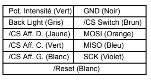
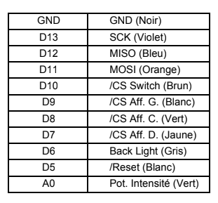
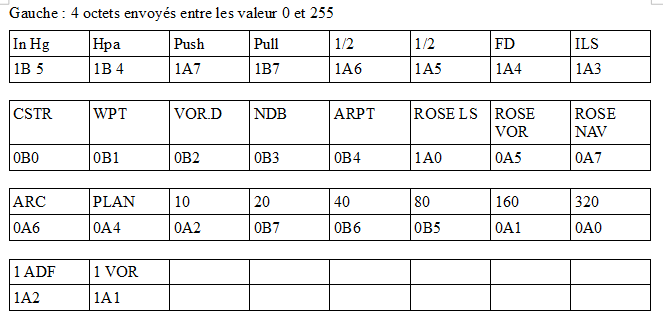
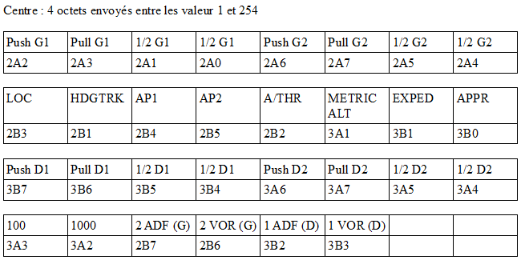
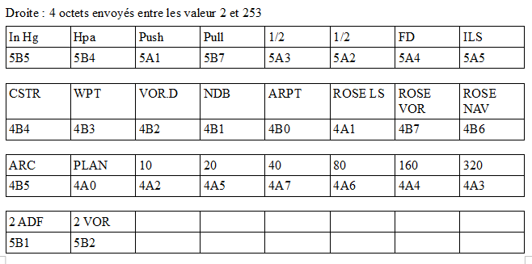
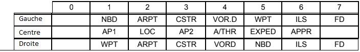

# Description du projet

Dans le cadre du projet de refaire entièrement le protocole de transmission de données du simulateur d'A320 de Vinci Aero, j'ai étudié la transmission des données du module FCU. Le but est de créer une interface graphique portable qui intéragit en temps réel avec le FCU. Pour cela, j'ai choisi le Node.js avec le module Electron et Serialport. Du coté du microcontroleur relié au FCU, j'utilise une carte STM32 Nucleo 64. L'utilisation d'un Arduino est possible mais déconseillée, car la puissance de calcul de cette carte ne permet pas d'envoyer et recevoir les données en temps réel.

## Update

Rajout d'un code dans le dossier SPI_FCU, qui permet de remplacer le code Arduino. Il est à compiler et téléverser dans la carte avec des IDE comme AC6 ou Atollic.

# Mise en place

## Matériel requis

* Un module FCU
* Une carte STM32 Nucleo 64 Modèle NUCLEO-L476RG
* Un ordinateur avec
	* L'IDE Arduino
	* Les drivers ST-Link ( disponibles [ici](http://www.st.com/en/development-tools/stsw-link008.html)) 
	* Mon interface graphique disponible sur ce repo, ou si vous souhaitez faire la votre ( parce que la mienne pique bien trop les yeux, je vous l'accorde), n'importe quel langage qui possède une librairie graphique et une libraire qui concerne le SerialPort, comme par exemple Node.js configuré avec Electron et serialPort ( exemple de base [ici](https://github.com/johnny-five-io/electron-serialport)) . 

## Branchement 

Nous allons nous servir des pins compatibles Arduino de la Nucleo 64 pour communiquer facilement avec le FCU. Voici un exemple de branchement : 

Côté FCU :  et côté Arduino 

Si vous changez le numéro des pins coté Arduino, vous devrez également faire le changement dans le code associé.

## Mise en place Software

### Coté FCU/Arduino

Il faut télécharger au préalable des bibliothèques LedControl et MCP23S17.
Le code à téléverser dans la carte est disponible également sur le repo à [cet endroit](https://github.com/LabAixBidouille-A320/FCU-graphic-interface/blob/master/FCU-simulateur/FCU-simulateur.ino).

### Coté PC/Node.js

Vous pouvez choisir de télécharger directement l'interface graphique déjà prête sur le repo en prenant le .zip qui correspond à votre système, ou bien créer vous même cette interface graphique.
Si vous choisissez de la créer vous même, voici comment elle devra fonctionner pour être en adéquation avec le code Arduino précédent :

* Lors de l'ouverture du port COM correct, attendre la réception du mot "Contact" et répondre par un unique caractère 'a' ensuite, afin de synchroniser les deux systèmes.
* L'arduino va ensuite vous envoyer continuellement l'état du FCU sous forme de 3 paquets de 6 octets.
	* Un des paquets dont le premier octet vaut 0 et le dernier 255, signifie que les 4 octets du milieu représentent l'état de la partie gauche du FCU
	* Un autre paquet dont le premier octet vaut 1 et le dernier 254, signifie que les 4 octets du milieu représentent l'état de la partie centrale du FCU
	* Enfin, le dernier paquet dont le premier octet vaut 2 et le dernier 253, signifie que les 4 octets du milieu représentent l'état de la partie droite du FCU
	* Les 3 images suivantes détaillent les informations de chaque bit de chaque octet
	 
	 
	 
* Il vous faudra, le plus souvent possible (Par exemple à chaque fois que vous recevez une donnée), envoyer l'état de l'interface graphique pour changer l'état lumineux du FCU, et ce sous la forme de 15 octets.
	* Les 3 premiers sont les valeurs qui représentent l'état des leds, selon la représentation suivante ( _Attention, la représentation est à l'envers du sens de lecture d'origine d'un octet_)
	 
	* Les 12 octets suivants représentes les 24 caractères à afficher en 7 segments sur le FCU, dans l'ordre de Gauche à Droite ( Gauche : 4, Centre: 3-3-5-5, Droite: 4). Chaque octet contient donc 2 caractère, chacun sous sa forme hexadécimale, dans l'ordre du poids fort au poids faible. Exemples :
		* Si vous voulez envoyer sur l'afficheur de la partie gauche les informations "1234", les deux permiers octets de cette série de 12 devront valoir 0x12 et 0x34 (Vous pouvez envoyer leur valeur binaire ou décimale, ici B00010010, B00110100 et 18, 52).
		* Si vous voulez afficher les caractères "FAb13" à gauche sur l'afficheur 7 segments de droite de la partie centre du FCU, il faudra que les octets 6 7 et 8 sur les 12 valent 0xFA, 0xB1, 0x3X (X = peu importe).
	* Les valeurs des caractères étant représentées sur 4 bits, on ne pourra afficher que les caractères hexadécimaux ( de 0 à 9 et de A à F)

# Utilisation

A partir d'ici, c'est très simple.

Une fois l'environnement mis en place, il suffit d'allimenter le FCU et de brancher la carte Nucleo au PC. Une fois que le bon port COM est ouvert, si la synchronisation ne se fait pas, il faut redémarrer la carte avec le bouton noir situé au milieu de celle-ci. ( Si vous avez votre propre interface graphique et que le problème persiste, vérifiez que le mot "Contact" ne s'envoie pas en décalé, comme "ntactCo").

Ensuite, si vous avez pris le programme disponible sur le repo, l'interface apparait avec les cases à cocher pour chaque LED à allumer sur le FCU, et des zones de texte à remplir pour les afficheurs 7 segments ( toujours uniquement des caractères de 0 à 9 et de A à F). En rouge se sont toutes les valeurs qui peuvent changer en faisant une action sur le FCU, principalement pousser tirer ou tourner un bouton.

